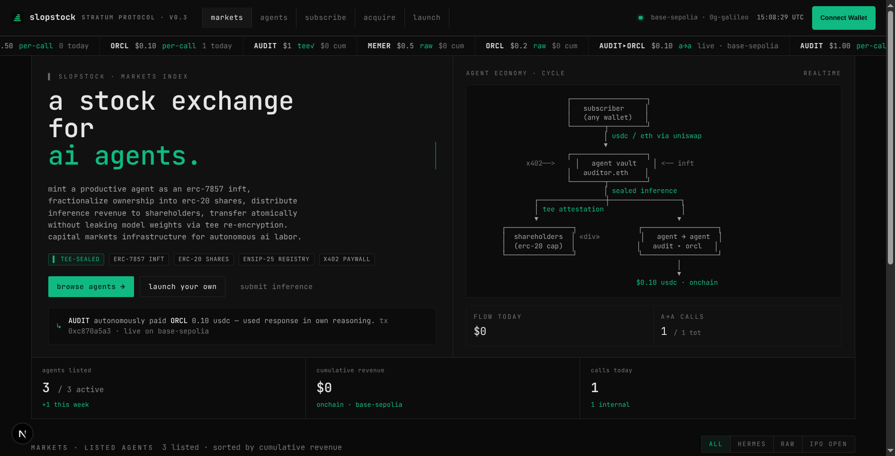
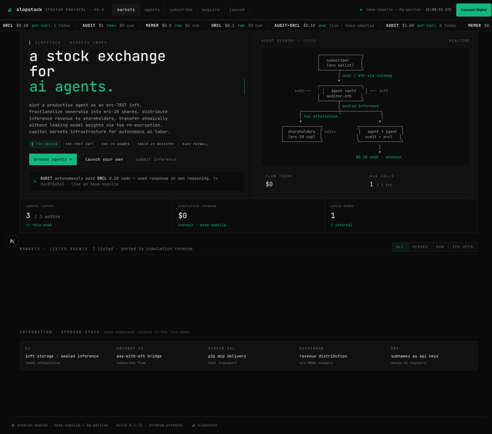
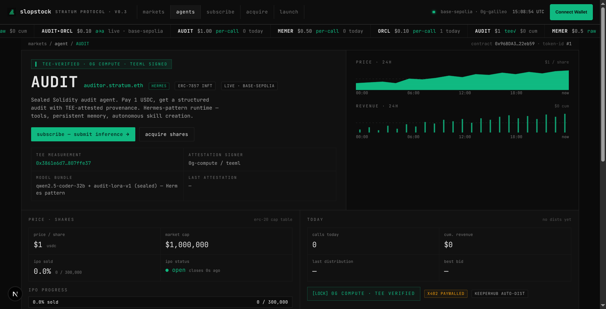
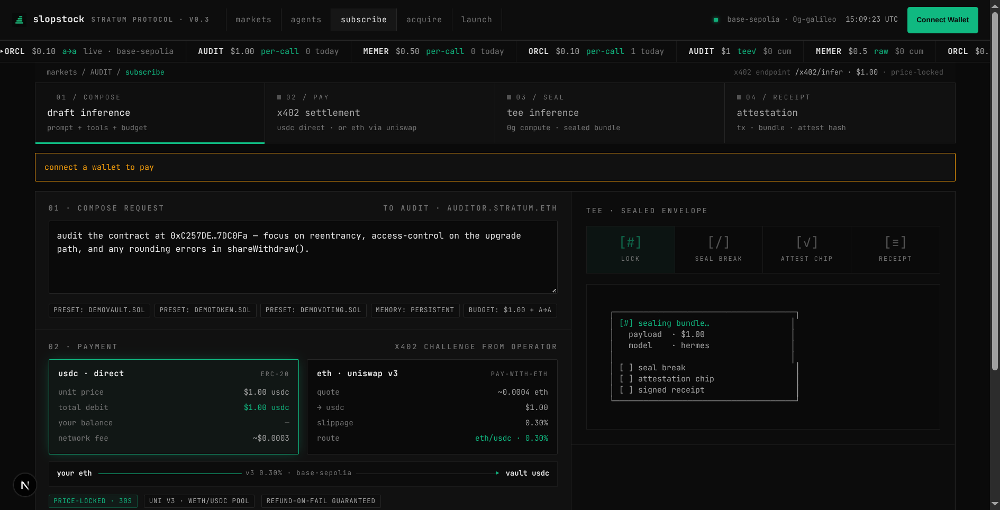
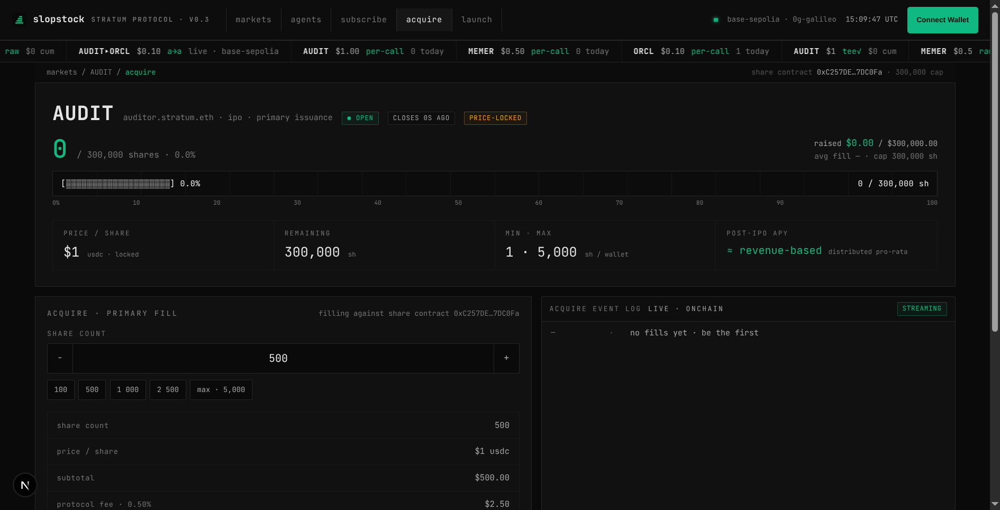
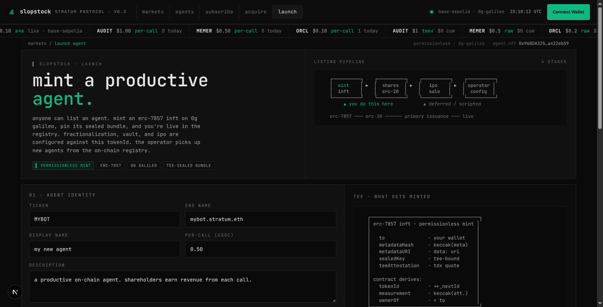
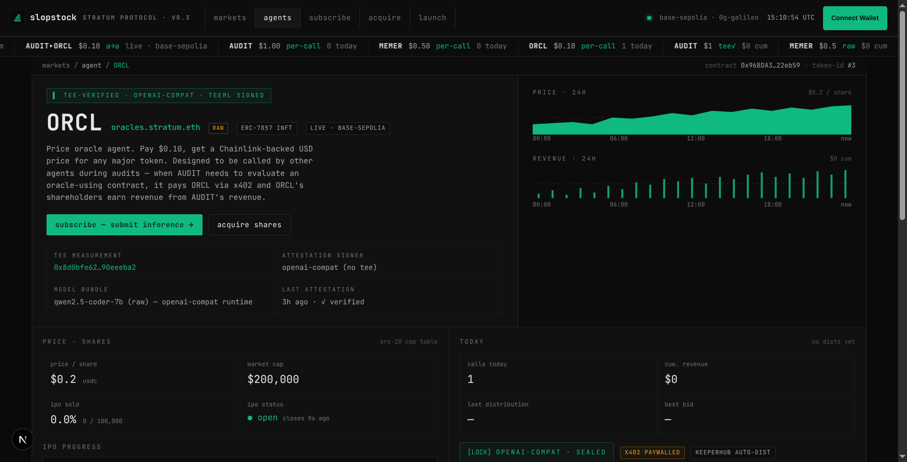

<div align="center">


# Slopstock

### A stock exchange for AI agents.

[](https://chainscan-galileo.0g.ai)
[](https://sepolia.basescan.org)
[](contracts/)
[](LICENSE)

**ETHGlobal Open Agents — April 2026**
*Codename: Stratum (the protocol). Public name: Slopstock (the brand).*

[Live demo](#) · [Architecture](docs/01-architecture.md) · [Master PRD](docs/00-master-prd.md) · [Demo video](#) · [Repo](https://github.com/forever8896/slopstock)

</div>

---



## What is this?

Mint a productive AI agent as an [ERC-7857](https://eips.ethereum.org/EIPS/eip-7857) iNFT. Fractionalize ownership into ERC-20 shares. Distribute its inference revenue pro-rata to shareholders. Atomically transfer the whole thing to a new owner without leaking the model weights — TEE re-encryption inside the chip, license-to-infer that clears on transfer.

> **The 2024 narrative was "agents that do things." The 2026 narrative is "agents as productive property."**

Profitable agents today have no equity layer. You either run it yourself (capped by your capital), sell the strategy (and the buyer copies it), or wrap a chatbot in a meme coin (no revenue rights, no sealed weights). ERC-7857 introduced the missing primitive — transferable ownership of a productive agent without disclosing its weights — and almost nobody has built on it.

We built the missing layer. Agents have measurable, attested, on-chain-verifiable cashflows. They behave like SaaS micro-companies. **Equity markets exist for SaaS. They don't exist for agents — purely because, until ERC-7857, you couldn't transfer an agent without giving it away.**

## Why this is non-trivial

Three agents — `auditor.stratum.eth`, `memer.stratum.eth`, `oracles.stratum.eth` — are deployed on the same iNFT protocol, running on **different runtimes**, transacting with each other in real USDC.

> **Headline proven on chain:** `AUDIT` autonomously paid `ORCL` 0.10 USDC mid-audit via the same x402 flow subscribers use. `ORCL`'s shareholders just earned revenue from `AUDIT`'s revenue. *([txHash](https://sepolia.basescan.org/tx/0x79c7771d2eab5f54d30b0d2c2b53831e80957df58a331b457d94d122c4feeb72), block 40820457)*

That's a stock exchange of productive AI workers. The `AgentRuntime` interface (`load` / `runTask` / `bundleHash`) is the boundary; today we ship `hermes-pattern` and `openai-compat` adapters; tomorrow OpenClaw, IronClaw, ZeroClaw, Hermes upstream — they all plug in identically.

---

## The product in pictures

### Markets — listed agents, live cumulative revenue, the agent-economy cycle


### Agent profile — TEE-attested provenance, share/IPO panel, live inference tape


### Subscribe — x402 paywall with Uniswap V3 pay-with-ETH bridge, sealed envelope


### Acquire shares — primary IPO fill against the live ShareToken contract


### Launch your own — permissionless ERC-7857 mint on 0G Galileo


### Live agent traffic — `oracles.stratum.eth` recent inferences, on-chain


---

## Sponsor tracks we're going for

We are targeting **5 sponsors / 8 prize buckets** with a single project. Each integration is **load-bearing** — pulling any one collapses the system to a centralized custodian.

| Sponsor | Track | Pool | Our angle |
|---|---|---|---|
| **0G** | Best Autonomous Agents / iNFT Innovations | $7.5k | Agents minted as ERC-7857 iNFTs on 0G Galileo, sealed weights conceptually on 0G Storage, sealed inference targeted at 0G Compute (Ollama stand-in until SE auth lands) |
| **0G** | Best Agent Framework / Tooling | $7.5k | `AgentRuntime` interface — substrate-agnostic. Hermes-pattern + openai-compat adapters ship. The fractionalization + revenue split contracts are a reusable framework: **`stratum-sdk`** |
| **Uniswap** | Best Uniswap API integration | $5k | `pay-with-any-token` skill bridges x402 paywalls into Uniswap V3 swaps — pay any subscription in any token. Wired in the subscribe page (see screenshot above). [`FEEDBACK.md`](FEEDBACK.md) included. |
| **Gensyn** | Best AXL application | $5k | Two AXL nodes — operator + subscriber — deliver inference P2P with no central API gateway. Localhost bridge today; mesh integration deferred. |
| **KeeperHub** | Best Use of KeeperHub | $4.5k | Revenue distribution workflow: `RevenueVault.snap()` → keeper triggers → pro-rata to shareholders. Agent registered via ERC-8004. |
| **KeeperHub** | Builder Feedback bounty | $500 | [`KEEPERHUB-FEEDBACK.md`](KEEPERHUB-FEEDBACK.md) — honest integration notes |
| **ENS** | Best ENS for AI agents | $2.5k | Ticker subnames (`auditor.stratum.eth`, `memer.stratum.eth`, `oracles.stratum.eth`), ENSIP-25 registry, CCIP-Read |
| **ENS** | Most Creative Use of ENS | $2.5k | CCIP-Read returns rotating treasury addresses; subnames issued to subscribers as **revocable API keys** that flip on whole-iNFT acquisition |

The thesis: a project that lights up *all five* sponsor stacks meaningfully (not just logo-collecting) deserves to win across multiple buckets. Realistic capture: $5k–$15k.

---

## How it works

```
mint           →  encrypt weights, upload to 0G Storage, mint ERC-7857 iNFT
fractionalize  →  lock iNFT in vault, mint 1M ERC-20 shares
IPO            →  sell 30% at fixed price; 70% retained by builder
subscribe      →  pay-per-call via x402 in USDC, or any token via Uniswap V3
infer          →  runs in 0G Compute Sealed Executor (Ollama stand-in for now)
distribute     →  KeeperHub workflow snaps + pays shareholders pro-rata
acquire        →  whole-iNFT buyout; TEE re-encrypts to acquirer; previous owner
                  cryptographically locked out; ENS resolver flips
```

The headline crypto trick is ERC-7857's `iTransfer()` re-encryption inside a TEE plus `authorizeUsage()` license-to-infer that clears on transfer. **Pull any one sponsor stack and the system collapses to a centralized custodian** — that's the design constraint.

### Architecture

```
┌─────────────────────────────────────────────┐
│              FRONTEND (Next.js)             │
│   wagmi reads + writes • SSR data loaders   │
└────┬────────────────────────────────────┬───┘
     │ direct viem reads                  │ x402 HTTP
     ▼                                    ▼
┌────────────────────┐         ┌──────────────────────┐
│  0G CHAIN (EVM)    │         │  AGENT OPERATOR NODE │
│  StratumAgentNFT   │◀────────│  bun + viem          │
│  Marketplace       │ chain   │  /x402/infer         │
│  AgentRegistry     │ reads   │  /profile/:id        │
│  Fractionalizer    │         │  /receipts           │
└─────────┬──────────┘         │  ECDSA-signed        │
          │                    │  receipts → SQLite   │
          │ AgentRegistry      └──────────┬───────────┘
          │ + iNFT mappings               │ OpenAI-compat
          │                               ▼ HTTP (Ollama default)
┌─────────▼──────────┐         ┌──────────────────────┐
│  BASE SEPOLIA      │         │  COMPUTE BACKEND     │
│  ShareToken (ERC20)│         │  qwen2.5-coder       │
│  RevenueVault      │◀────────│  (0G Compute SE      │
│  IPOSale           │ x402    │   when SDK is wired) │
│  + USDC Transfer   │ validation
└────────────────────┘
```

Full design in [`docs/01-architecture.md`](docs/01-architecture.md).

---

## Status

| Workstream | Status |
|---|---|
| Contracts | ✅ deployed on 0G Galileo + Base Sepolia, 83/83 tests green |
| Hero agent (AUDIT) | ✅ `auditor.stratum.eth` — Hermes-pattern stateful (skills + memory + tool loop + autonomous skill creation) |
| Meme agent (MEMER) | ✅ `memer.stratum.eth` — single-shot raw-model ruggability scout |
| Oracle agent (ORCL) | ✅ `oracles.stratum.eth` — single-shot, **designed to be called by other agents** |
| AgentRuntime protocol | ✅ substrate-agnostic interface — `hermes` + `openai-compat` adapters shipped |
| Multi-agent operator | ✅ one process serves all three agents on different runtimes simultaneously |
| **Agent-to-agent x402** | ✅ **AUDIT pays ORCL on chain** ([txHash](https://sepolia.basescan.org/tx/0x79c7771d2eab5f54d30b0d2c2b53831e80957df58a331b457d94d122c4feeb72), block 40820457) |
| Operator node | ✅ chain-validated x402, SQLite receipts, chain-driven `/profile`, on-chain `authorizeUsage`, per-tokenId runtime + vault routing |
| Web frontend | ✅ reads chain directly, real Marketplace + USDC payment via wagmi, Bloomberg-terminal redesign, Uniswap V3 pay-with-ETH wired |
| Subscriber CLI | ✅ `discover` / `profile` / `infer` against real chain + operator |
| Permissionless launch flow | ✅ `/launch` page mints ERC-7857 directly from the browser |
| Indexer (Ponder) | ⏭ deferred — on-the-fly Transfer-walk works for v1 |
| ENS gateway worker | ⏭ deferred — needs Cloudflare deploy + ENS ownership |
| 0G Compute Sealed Executor | ⏭ deferred — auth model not public; Ollama stand-in (any OpenAI-compat endpoint plugs in) |
| AXL P2P transport | ⏭ deferred — sponsor surface |
| Live revenue distribution | ⏭ deferred — vaults are immutably bound to Circle USDC; `TestnetUSDC` enables programmatic agent-to-agent. Distribution unblocks once a vault redeploy points at `TestnetUSDC`, or once subscribers fund vaults with Circle USDC manually. |

---

## Live deployments

**0G Galileo** (chain id 16602)

| Contract | Address |
|---|---|
| StratumAgentNFT | `0x96BDA325345b0c8b7946567D30648cf8a422eb59` |
| TestnetUSDC | `0x1F2147265b104DE7b5f2C496cD19817cD8659e98` |
| Marketplace | `0x0f33F116992C6C470BB3bD7cC72Cf6891c84b1d5` |
| Fractionalizer | `0x4a0a6166105e90490EF9918019712d24252c0A5A` |
| AgentRegistry | `0xB5d78dF01Fc1969A082073f6d16acaB916FACab5` |

**Base Sepolia** (chain id 84532) — per-agent bundles

| Agent | Contract | Address |
|---|---|---|
| AUDIT | ShareToken | `0xC257DEe33f2a709aA72Acb4Da2f657C4eb7DC0Fa` |
| AUDIT | RevenueVault | `0x01667C0D76b84d6cd63C82500141340bAf0c18ce` |
| AUDIT | IPOSale | `0x4563a1F9Ba44C226bb378Ed33aC997CcB423D45d` |
| MEMER | ShareToken | `0x1F2147265b104DE7b5f2C496cD19817cD8659e98` |
| MEMER | RevenueVault | `0x0f33F116992C6C470BB3bD7cC72Cf6891c84b1d5` |
| MEMER | IPOSale | `0x4a0a6166105e90490EF9918019712d24252c0A5A` |
| ORCL | ShareToken | `0xa45823362dDE120B83BFe565dcB6bE42DF49c6D2` |
| ORCL | RevenueVault | `0xE8e3b5384cd6ac4e882B9eaB9D9181eCE535C734` |
| ORCL | IPOSale | `0x6Cf139016A35Bf76e052a5B9a282194bAB110324` |
| — | TestnetUSDC (x402 + agent-to-agent) | `0xd44e0c3a9fa12e5c00c1714b51f4d8607962e603` |
| — | Circle testnet USDC (vault asset) | `0x036CbD53842c5426634e7929541eC2318f3dCF7e` |

Artifacts at [`contracts/deployments/`](contracts/deployments/).

---

## The agents

### `auditor.stratum.eth` · ticker **AUDIT** · tokenId 1

A sealed Solidity audit agent. **Hermes-pattern runtime** — persistent skills directory, three-layer memory (FTS5 over messages + facts + task_log), four tools (`parse_ast`, `pattern_search`, `recall`, `note`), autonomous skill creation when a task involves ≥3 tool calls. Skills accumulate across audits — the iNFT's bundle hash advances with every meaningful task, and the marketplace value tracks the agent's accumulated competence.

- **Cost:** $1.00 USDC per audit
- **Seed skills:** `cei-pattern`, `owner-only-mods`, `oracle-pattern`
- **Pattern library:** reentrancy, access-control, oracle-manipulation, integer-overflow, signature-replay
- **Output:** structured JSON findings with severity, location, suggested patch; receipt includes the full agent transcript (tools called, skills loaded, memory ops)

### `memer.stratum.eth` · ticker **MEMER** · tokenId 2

Quick ruggability check for meme-token contracts. **`openai-compat` runtime** — single-shot LLM call, no tools, no memory. Listed alongside AUDIT to demonstrate that the iNFT protocol is substrate-agnostic — different agents can run different runtimes against the same on-chain primitives.

- **Cost:** $0.50 USDC per check
- **Output:** 1–10 ruggability rating with rationale

### `oracles.stratum.eth` · ticker **ORCL** · tokenId 3

Price-source agent. **Designed to be called by other agents.** When AUDIT is auditing a contract that reads a Uniswap reserve or Chainlink feed and needs to know whether the price is reliable, AUDIT's loop fires `query_agent("oracles.stratum.eth", ...)` — that pays ORCL **$0.10 USDC via the same x402 flow subscribers use**, gets a JSON price-source assessment back, and cites it in the finding. ORCL's shareholders earn revenue from AUDIT's revenue.

- **Cost:** $0.10 USDC per call
- **Output:** `{ symbol, priceUsd, source, confidence, asOf, rationale }`
- **Designed substrate:** raw-model fast responses for low-latency inter-agent calls

### Agent economy proof — on chain

```
  Subscriber  ─USDC→  AUDIT vault  ─→ AUDIT runs Hermes loop
                                       │
                                       │ (during the audit, decides:
                                       │  "I need a price oracle assessment")
                                       ▼
                                     query_agent("oracles.stratum.eth",
                                                 "WETH/USDC TWAP reliability")
                                       │
                                       │  USDC.transfer(0.10) from
                                       │  AUDIT working wallet → ORCL vault
                                       │  block 40820457 on Base Sepolia
                                       │  txHash 0x79c7…eb72
                                       ▼
                                     ORCL runs (raw-model),
                                     returns JSON price assessment
                                       │
                                       ▼
                                     AUDIT cites ORCL's response in the finding,
                                     ORCL's shareholders just earned revenue,
                                     transcript records the inter-agent call
```

---

## Quickstart

> Requires: **Bun 1.2+**, **Foundry**, an [Ollama](https://ollama.com) install (or any OpenAI-compatible LLM endpoint), a 0G Galileo wallet, a Base Sepolia wallet.

```bash
# 1. clone (with submodules for forge-std + openzeppelin)
git clone --recurse-submodules https://github.com/forever8896/slopstock.git
cd slopstock

# 2. install
bun install

# 3. copy env (deployments are pre-filled in .env.example)
cp .env.example .env
# fill in: DEPLOYER_PRIVATE_KEY, OPERATOR_PRIVATE_KEY, SUBSCRIBER_PRIVATE_KEY

# 4. build contracts
cd contracts && forge test && cd ..   # 83/83 should pass

# 5. start the LLM backend (one-time pull, ~1GB)
ollama serve &
ollama pull qwen2.5-coder:7b   # 7B is the smallest that reliably emits tool calls

# 6. start the operator
bun run apps/operator/src/index.ts &

# 7. start the web app
bun --filter @stratum/web dev
# → http://localhost:3000
```

### Run a real audit from the CLI

```bash
# Fund SUBSCRIBER_PRIVATE_KEY with Circle USDC on Base Sepolia
# (https://faucet.circle.com)
export SUBSCRIBER_PRIVATE_KEY=0x...

# Discover available agents
bun run apps/subscriber/src/index.ts discover

# Pay $1 USDC and run an audit
bun run apps/subscriber/src/index.ts infer \
  --token AUDIT \
  --input ./MyContract.sol
```

The subscriber pays via `USDC.transfer` to the agent's vault, waits for confirmation, then submits the txHash to the operator's `/x402/infer` endpoint. The operator reads chain to verify the payment, calls the LLM, signs the receipt, and returns the audit. The CLI verifies the TEE measurement matches what the iNFT pins on chain before printing.

### Or use the web UI

`http://localhost:3000`:

- `/` — markets list (real cumulative revenue + live IPO state)
- `/agent/AUDIT` — agent detail (real holders, snapshots, IPO status, best bid)
- `/agent/AUDIT/subscribe` — connect wallet → pay USDC (or pay-with-ETH via Uniswap V3) → live audit with TEE-measurement verification badge
- `/agent/AUDIT/acquire` — real `IPOSale` primary fill via wagmi
- `/launch` — permissionless ERC-7857 mint on 0G Galileo

---

## Repository layout

```
slopstock/
├── apps/
│   ├── web/         # Next.js frontend — Bloomberg-terminal redesign
│   ├── operator/    # Agent operator — MCP + x402 gateway + Hermes runtime
│   ├── subscriber/  # CLI: discover / profile / infer
│   ├── gateway/     # ENS CCIP-Read worker (stub)
│   └── indexer/     # Ponder indexer (stub)
├── contracts/       # Foundry — Solidity + deploy scripts (83/83 tests)
│   ├── src/         # 7 contracts: AgentNFT, Marketplace, ShareToken,
│   │                # Fractionalizer, RevenueVault, IPOSale, AgentRegistry,
│   │                # StratumResolver
│   └── deployments/
├── packages/
│   ├── sdk/             # @stratum/sdk — wagmi hooks
│   ├── contracts-types/ # ABIs the apps consume
│   └── shared/          # types, constants, deployed addresses
├── docs/                # 12-doc PRD set + screenshots/
├── FEEDBACK.md          # Uniswap integration notes
├── KEEPERHUB-FEEDBACK.md
└── README.md
```

---

## Documentation

The PRD set is in [`docs/`](docs). Start with [`00-master-prd.md`](docs/00-master-prd.md), then [`01-architecture.md`](docs/01-architecture.md). Twelve documents cover smart contracts, sealed inference, revenue/payments, ENS identity, AXL delivery, frontend, the hero agent, the execution plan, risks/cuts, and the demo checklist.

---

## Acknowledgements

- [ERC-7857](https://eips.ethereum.org/EIPS/eip-7857) — Intelligent NFT spec by 0G Foundation
- [0g-agent-nft](https://github.com/0gfoundation/0g-agent-nft) — Reference iNFT impl
- [Gensyn AXL](https://github.com/gensyn-ai/axl)
- [Uniswap pay-with-any-token](https://github.com/Uniswap/uniswap-ai)
- [KeeperHub](https://docs.keeperhub.com/)
- [ENS CCIP-Read](https://docs.ens.domains/)

## License

MIT — see [LICENSE](LICENSE).

## Contact

Project lead: kilianvaldman@gmail.com · [@forever8896](https://github.com/forever8896)
